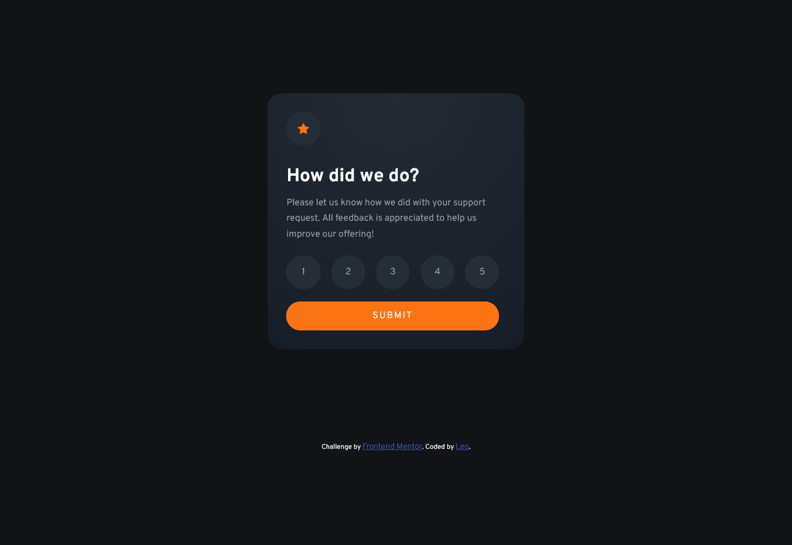
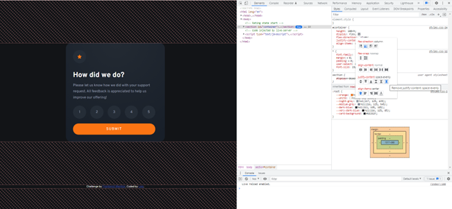

# Frontend Mentor - Interactive rating component solution

This is a solution to the [Interactive rating component challenge on Frontend Mentor](https://www.frontendmentor.io/challenges/interactive-rating-component-koxpeBUmI). Frontend Mentor challenges help you improve your coding skills by building realistic projects.

## Table of contents

- [Overview](#overview)
  - [The challenge](#the-challenge)
  - [Screenshot](#screenshot)
  - [Links](#links)
- [My process](#my-process)
  - [Built with](#built-with)
  - [What I learned](#what-i-learned)
  - [Continued development](#continued-development)
  - [Useful resources](#useful-resources)
- [Author](#author)

## Overview

### The challenge

Users should be able to:

- View the optimal layout for the app depending on their device's screen size
- See hover states for all interactive elements on the page
- Select and submit a number rating
- See the "Thank you" card state after submitting a rating

### Screenshot



### Links

- Solution URL: [https://github.com/Kinzume/interactive-rating-component-main](https://github.com/Kinzume/interactive-rating-component-main)
- Live Site URL: [https://kinzume.github.io/interactive-rating-component-main/](https://kinzume.github.io/interactive-rating-component-main/)

## My process

### Built with

- HTML5 markup
- CSS Flexbox
- JavaScript

### What I learned

Whilst previewing my project in the browser, I learnt how to change code directly using DevTools. I found this especially useful when trying to position elements on the page using flexbox. I also enjoyed discovering different types of properties and methods when examining the DOM.



I'm also happy with how my event listener turned out for the buttons as I was expecting this to be a bit more lengthy.

```js
submit.addEventListener("click", displayThankYou);
function displayThankYou() {
  if (
    rating.some((currentValue) => {
      return currentValue.checked == true;
    })
  ) {
    const selectedRating = rating.filter((currentValue) => {
      return currentValue.checked == true;
    })[0].labels[0].innerHTML;
    ratingCard.style.display = "none";
    ratingMessage.innerHTML = `You selected ${selectedRating} out of 5`;
    thankYouCard.style.display = "flex";
  } else return;
}
```

I also learnt how to style checked radio buttons by using the :checked and element + element selectors

```html
<input type="radio" id="one-star" name="rating" />
<label for="one-star" class="circle">1</label>
```

```css
input[type="radio"]:checked + label {
  color: var(--white);
  background-color: var(--light-grey);
}
```

### Continued development

I look forward to using DevTools to help with debugging and styling in future projects.

I would like to gain a better understanding of writing semantic HTML so that my future projects are more accessible.

### Useful resources

- [https://www.youtube.com/watch?v=sSF0bXFUFGM&ab_channel=CodingArtist](https://www.youtube.com/watch?v=sSF0bXFUFGM&ab_channel=CodingArtist) - This is the video which helped me understand how I could approach styling my radio buttons.

## Author

- Frontend Mentor - [@Kinzume](https://www.frontendmentor.io/profile/Kinzume)
